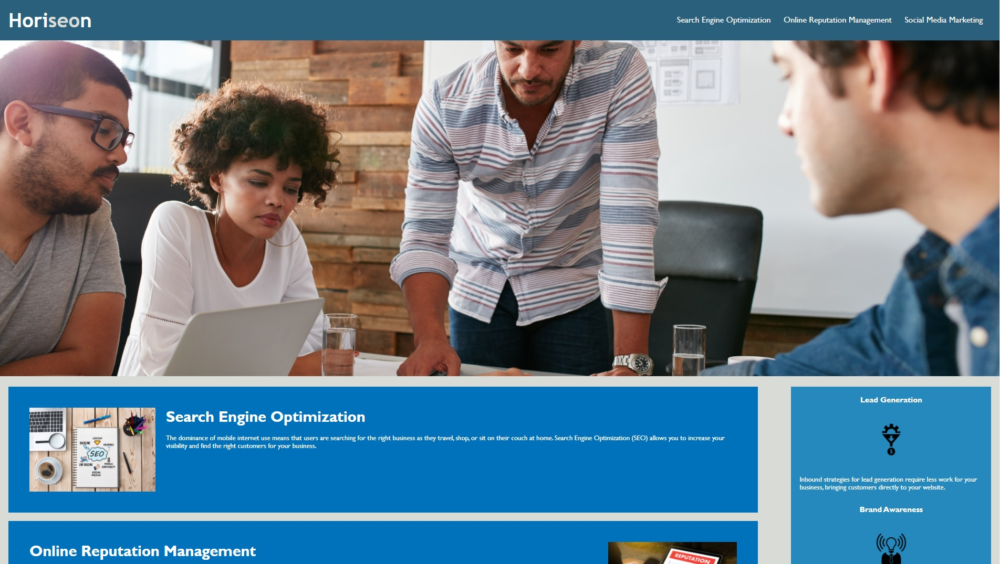

# Homework 1: Code Refactor

## HTML/CSS Changes
1. Changed title to Horiseon Social Solutions.
2. Changed div class header to semantic header.
3. Changed div in header to semantic nav.
4. Changed div class content to semantic main
5. Changed div class footer to semantic footer
6. Re-ordered style sheet to flow logically
7. Gave single-use classes unique id
8. Grouped every benefit into one class to reduce repetitive styling
+ * Note: Didn't do this in main content for linking purposes
9. Changed benefits div to section
10. Added screenshot to assets for this README

## Goals for Code Refactor

### A webpage meets accessibility standards:
* WHEN I view the source code
  * THEN I find semantic HTML elements
* WHEN I view the structure of the HTML elements
  * THEN I find that the elements follow a logical structure independent of styling and positioning
* WHEN I view the image elements
  * THEN I find accessible alt attributes
* WHEN I view the heading attributes
  * THEN they fall in sequential order
* WHEN I view the title element
  * THEN I find a concise, descriptive title
